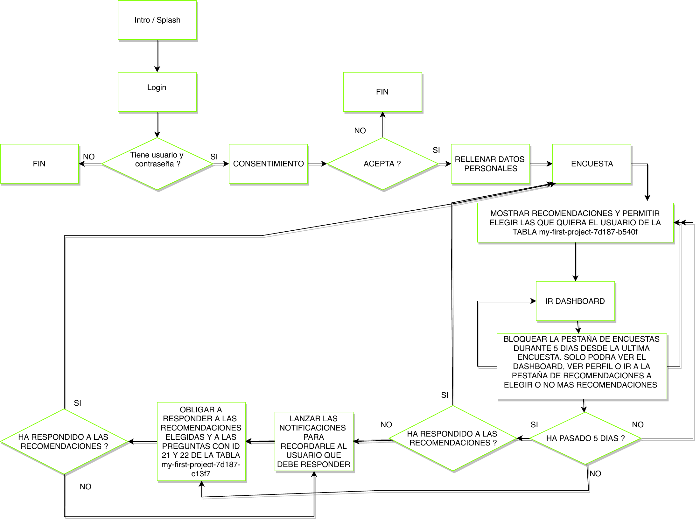

# eBurnout

### Occupational Burnout Detection & Management Platform

### Engineering Highlights

| 📱 Multi-Platform Product | ☁️ Cloud & Offline Data | ⌚ Health Data Integration |
| --- | --- | --- |
| Ionic/Angular mobile application for iOS and Android, plus an Angular analytics dashboard. | Firebase services and real-time data synchronization, with SQLite/Ionic Storage dependencies and local persistence. | Burnout assessments, Fitbit wearable/physiological data integration, and analytics across mobile and web interfaces. |

<p align="center">
  <a href="assets/eburnout-architecture.png"></a>
</p>

> **Historical architecture:** Original application workflow from the legacy Ionic 3 / Angular 5 era; this is a historical flow diagram, not a current deployment diagram. [Original PDF](DIAGRAMA%20DE%20FLUJO%20eburnout.pdf).


A comprehensive, full-stack **health-tech ecosystem** designed to assess, monitor and support the management of occupational burnout risk among healthcare professionals.

eBurnout combines **questionnaire-based assessment, physiological data, wearable integration, mobile engineering, predictive risk concepts and real-time analytics** in a multi-platform system designed for clinical environments.

> **Engineering scope:** From data-science conceptualization and predictive-risk modeling to mobile applications, cloud services, wearable integration and institutional analytics.

[Overview](#-overview) ·
[Architecture](#-system-architecture) ·
[Engineering](#-key-engineering-features) ·
[Stack](#-technology-stack) ·
[Decisions](#-architectural-decisions) ·
[Run](#-getting-started)

---

## 🎯 Overview

Occupational burnout is a multidimensional problem that cannot be represented adequately by a single data source.

eBurnout was designed around a broader assessment model combining:

- **Maslach-based burnout assessment**
- **Physiological data**
- **Wearable-device information**
- **Behavioral and longitudinal indicators**
- **Predictive risk concepts**
- **Risk visualization and monitoring**

The system was conceived for **healthcare professionals** and developed in connection with real hospital environments.

Rather than implementing an isolated model or questionnaire, eBurnout addresses the complete engineering problem:

```text
Data Acquisition
      ↓
Local & Cloud Persistence
      ↓
Data Processing
      ↓
Risk Assessment
      ↓
Visualization
      ↓
Institutional Monitoring
```

---

## 🏗️ System Architecture

```text
                         ┌─────────────────────┐
                         │ Healthcare          │
                         │ Professional        │
                         └──────────┬──────────┘
                                    │
                                    ▼
                         ┌─────────────────────┐
                         │ Ionic / Angular App │
                         │    iOS · Android    │
                         └──────────┬──────────┘
                                    │
                   ┌────────────────┴────────────────┐
                   │                                 │
                   ▼                                 ▼
        ┌────────────────────┐            ┌────────────────────┐
        │ Maslach &          │            │ Fitbit / Wearable  │
        │ Assessment Data    │            │ Physiological Data │
        └─────────┬──────────┘            └─────────┬──────────┘
                  │                                 │
                  └────────────────┬────────────────┘
                                   │
                                   ▼
                        ┌─────────────────────┐
                        │ Risk Assessment &   │
                        │ Application Logic   │
                        └──────────┬──────────┘
                                   │
                 ┌─────────────────┴─────────────────┐
                 │                                   │
                 ▼                                   ▼
      ┌─────────────────────┐             ┌─────────────────────┐
      │ Personal Dashboard  │             │ Institutional       │
      │ & Risk Indicators   │             │ Analytics Dashboard │
      └─────────────────────┘             └──────────┬──────────┘
                                                    │
                                                    ▼
                                         ┌─────────────────────┐
                                         │ Firebase Cloud      │
                                         │ Services            │
                                         └─────────────────────┘
```

The architecture separates the user-facing mobile experience, analytical interfaces, external data sources and cloud services while keeping them integrated as a single product ecosystem.

---

## 🧩 System Components

### 📱 Mobile Application — `BurnOut/Ionic`

An offline-first, cross-platform application for **iOS and Android**, built with Ionic 3, Angular 5 and TypeScript.

The mobile application provides the user-facing experience for:

- completing burnout assessments;
- collecting and presenting behavioral indicators;
- integrating physiological information;
- accessing wearable-derived data;
- visualizing personalized risk indicators;
- operating with local persistence when network connectivity is limited.

---

### 📊 Web Analytics Dashboard — `BurnOut/Back`

A responsive Angular-based administrative and analytical interface.

The dashboard provides visualization of burnout indicators and longitudinal information, supporting an aggregate view of the data for institutional analysis.

Interactive charts allow complex health-related indicators to be presented in a more accessible form.

---

### ☁️ Cloud & Web Layer — `BurnOutLanding` and application configuration

Firebase-backed components provide the cloud-connected and public-facing layers of the eBurnout ecosystem.

The architecture incorporates managed cloud services for areas including:

- authentication;
- real-time data persistence;
- synchronization;
- hosting;
- public web components.

---

## ⚙️ Key Engineering Features

### 📱 Cross-platform Mobile Engineering

A shared Ionic/Angular codebase targets iOS and Android while retaining access to native device capabilities through Cordova.

This approach reduces duplicated application logic while maintaining a common architecture across mobile platforms.

---

### ⌚ Wearable & Physiological Data Integration

The project contains **Fitbit authentication and integration logic**, allowing physiological information obtained from wearable devices to complement questionnaire-based burnout assessment.

This creates a multi-source data model rather than relying exclusively on self-reported information.

---

### 🧠 Predictive Risk & Data Science

eBurnout was conceived as part of a broader data-driven approach to occupational burnout.

The engineering ecosystem connects application-generated assessment information and physiological data with the conceptualization of **predictive risk modeling and machine-learning-based risk stratification**.

This data-science dimension complements the operational mobile and cloud architecture.

---

### 💾 Offline-First Data Persistence

Local caching through **Cordova SQLite Storage and Ionic Storage** allows the application to retain functionality in environments with limited or unstable network connectivity.

This design is particularly relevant in clinical environments where continuous connectivity cannot always be assumed.

Synchronization mechanisms allow locally persisted information to be reconciled with the connected application environment when connectivity becomes available.

---

### 📊 Advanced Data Visualization

Interactive dashboards use technologies including:

- **ECharts**
- **ngx-echarts**
- **Chart.js**

to visualize multidimensional burnout indicators across mobile and web interfaces.

---

### ☁️ Serverless Cloud Architecture

Firebase provides managed backend capabilities including authentication, real-time persistence and hosting.

The serverless approach reduces the need to operate a traditional application-server infrastructure while providing scalable managed services for the application.

---

### 📷 Native Device Integration

Cordova enables access to native device functionality, including camera capabilities and secure in-app browsing for supporting application workflows.

---

### 🔐 Security & Privacy

The system incorporates secure authentication flows, controlled access and data-anonymization considerations appropriate for handling sensitive occupational-health information.

The deployed environment was also subjected to external security validation, including **McAfee SECURE certification**.

---

### 🐳 Containerized Development

Docker tooling is included as part of the Ionic development workflow. Its historical Ubuntu 16.04 / Node.js 8 installation paths require review before rebuilding today.

---

## 🧰 Technology Stack

| Layer | Technologies |
|---|---|
| 📱 **Mobile** | Ionic 3 · Angular 5 · TypeScript · Cordova |
| 🖥️ **Web Dashboard** | Angular 5 · Angular Flex-Layout · RxJS |
| ☁️ **Cloud / Backend** | Firebase Authentication · Realtime Database · Hosting · AngularFire2 |
| 📊 **Visualization** | ECharts · ngx-echarts · Chart.js |
| 💾 **Local Persistence** | Cordova SQLite Storage · Ionic Storage |
| ⌚ **Wearables** | Fitbit API · OAuth |
| 🐳 **Development** | Docker · npm · Ionic CLI · Angular CLI |
| 📲 **Platforms** | iOS · Android · Web |

---

## ⚖️ Architectural Decisions

Architecture is not simply a collection of technologies. Each major technology choice involved a trade-off between development speed, operational complexity, resilience and flexibility.

### ☁️ Serverless vs. Custom Backend

**Decision — Firebase**

Firebase was selected as the managed backend platform.

**Why**

It enabled rapid development, authentication, real-time synchronization and managed hosting without requiring a conventional server infrastructure.

**Trade-off**

The architecture sacrifices some relational-query flexibility and introduces greater coupling to Firebase's data model in exchange for:

- lower infrastructure-management overhead;
- native real-time synchronization;
- faster development cycles;
- managed scalability.

---

### 💾 Offline-First vs. Cloud-Dependent Mobile

**Decision — Local SQLite / application storage**

The mobile application incorporates local persistence instead of depending exclusively on continuous API connectivity.

**Why**

Clinical environments may contain areas where network connectivity is unreliable.

**Trade-off**

Local persistence increases state-management and synchronization complexity but provides significantly greater application resilience.

---

### 📱 Cross-platform vs. Native Applications

**Decision — Ionic + Angular + Cordova**

A shared application architecture was selected for iOS and Android.

**Trade-off**

The approach reduces duplicated development effort and enables a common codebase while introducing:

- a hybrid runtime;
- dependency on Cordova plugins;
- additional abstraction around native platform capabilities.

---

### ⌚ Questionnaire-only vs. Multi-source Assessment

**Decision — Combine assessment and physiological data**

Traditional questionnaire-derived burnout information was complemented with physiological information obtained from wearable devices.

**Trade-off**

Integrating heterogeneous sources increases data and application complexity, but provides a richer analytical foundation than a single-source assessment model.

---

### 📊 ECharts vs. Lower-level Visualization

**Decision — ECharts / Chart.js**

Higher-level visualization libraries were selected for analytical interfaces.

**Trade-off**

The architecture accepts less low-level visualization control in exchange for:

- faster implementation;
- responsive dashboards;
- reusable visualization components;
- straightforward Angular integration.

---

## 🔄 End-to-End Engineering

eBurnout spans multiple engineering domains within one system:

```text
                 Clinical Use Case
                        │
                        ▼
                Mobile Application
                        │
              ┌─────────┴─────────┐
              │                   │
              ▼                   ▼
        Questionnaire         Wearables
           Data            Physiological Data
              │                   │
              └─────────┬─────────┘
                        │
                        ▼
                Data Persistence
                        │
                        ▼
              Processing & Analytics
                        │
                        ▼
               Risk Assessment
                        │
              ┌─────────┴─────────┐
              │                   │
              ▼                   ▼
        Personal Risk       Institutional
          Dashboard           Analytics
              │                   │
              └─────────┬─────────┘
                        │
                        ▼
                  Cloud Services
```

The project therefore represents more than an individual mobile application.

It brings together:

**Software Engineering · Data Integration · Mobile · Cloud · Analytics · Health-Tech**

---

## 📂 Project Structure

```text
eburnout/
│
├── BurnOut/
│   │
│   ├── Ionic/                 # iOS / Android mobile application
│   │
│   └── Back/                  # Analytics & administration dashboard
│
├── BurnOutLanding/            # Web / Firebase components
│
├── DIAGRAMA DE FLUJO eburnout.pdf
│                              # System architecture & application flows
│
└── README.md                  # Project documentation
```

---

## 🚀 Getting Started

> **Legacy environment:** eBurnout was developed using the Ionic 3 / Angular 5 ecosystem. Reproducing the original application may require compatible Node.js and dependency versions.

### 1. Mobile Application

```bash
cd BurnOut/Ionic
npm install
ionic serve
```

For Android:

```bash
ionic cordova platform add android
ionic cordova run android
```

For iOS, configure the corresponding Cordova/iOS development environment.

---

### 2. Web Analytics Dashboard

```bash
cd BurnOut/Back
npm install
ng serve
```

Then open:

```text
http://localhost:4200/
```

---

## 🧭 From eBurnout to Data & AI Architecture

eBurnout represents an earlier stage of my engineering work where several themes that remain central to my work today were already converging:

**data acquisition · system integration · cloud services · analytics · architecture**

My current work extends those foundations toward:

**AWS Data Architecture · Generative AI · Amazon Bedrock · RAG · Big Data · AI-ready data platforms**

---

## 📋 Project status & evidence

This is a historical project. The author confirms its development for physicians and work in two hospital environments, together with the capabilities described above. The McAfee SECURE statement refers to the historical deployed environment; it is not a claim of current certification or a new security assessment.

- Mobile and dashboard manifests document Ionic/Angular, Firebase, charting and local-storage dependencies.
- The repository includes Fitbit provider code and Firebase configuration.
- The companion [Burnout ML analysis](https://github.com/sukuzhanay/Machine-Learning-BurnOut-Project) contains the notebook, Orange workflow and academic report. It is separate from the application runtime.
- Reproduction, current deployment availability and clinical predictive performance were not revalidated by this documentation update.


## Author

**Christian Vladimir Sucuzhanay Arévalo**

Data & AI Solutions Architect | AWS Data Architecture | Generative AI & Amazon Bedrock | Big Data | Former University Lecturer

[Entity Home](https://christiansucuzhanay.com/) · [Technical Portfolio](https://sukuzhanay.github.io/) · [LinkedIn](https://www.linkedin.com/in/sucuzhanay) · [AWS Builder](https://builder.aws.com/community/@sukuzhanay) · [GitHub](https://github.com/sukuzhanay)

**Build. Explain. Teach. Share.**
